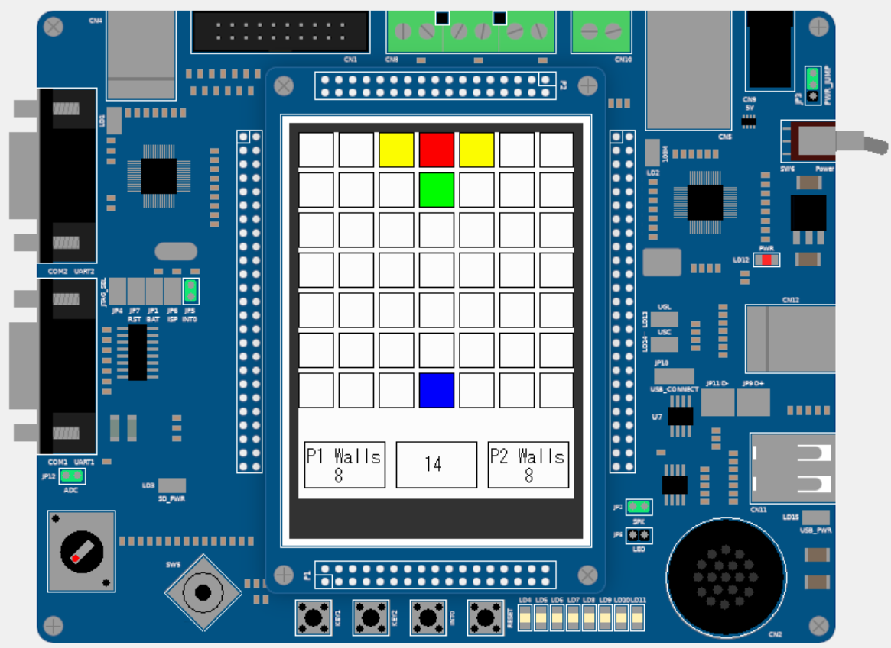
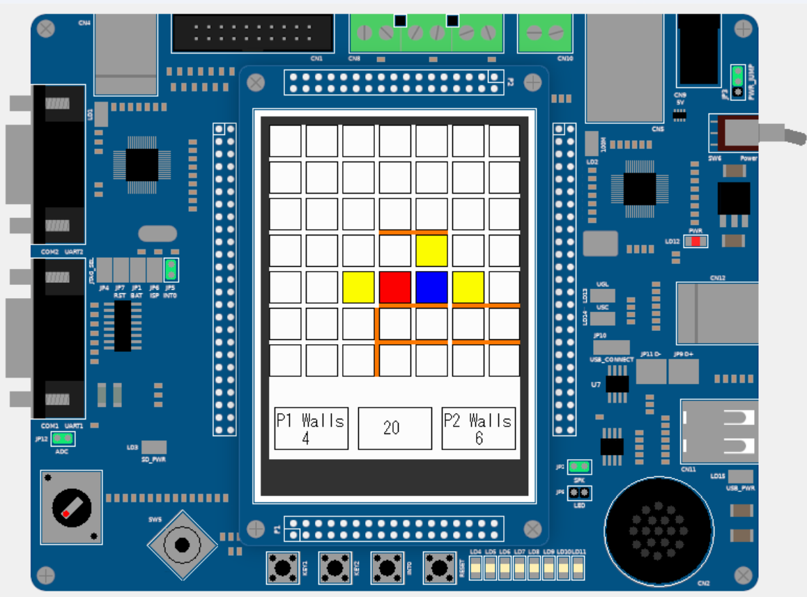
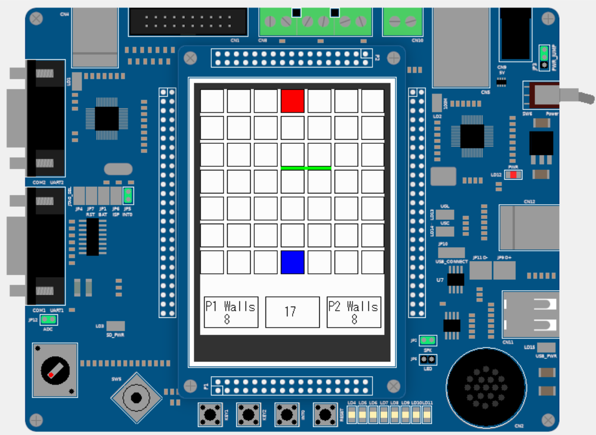
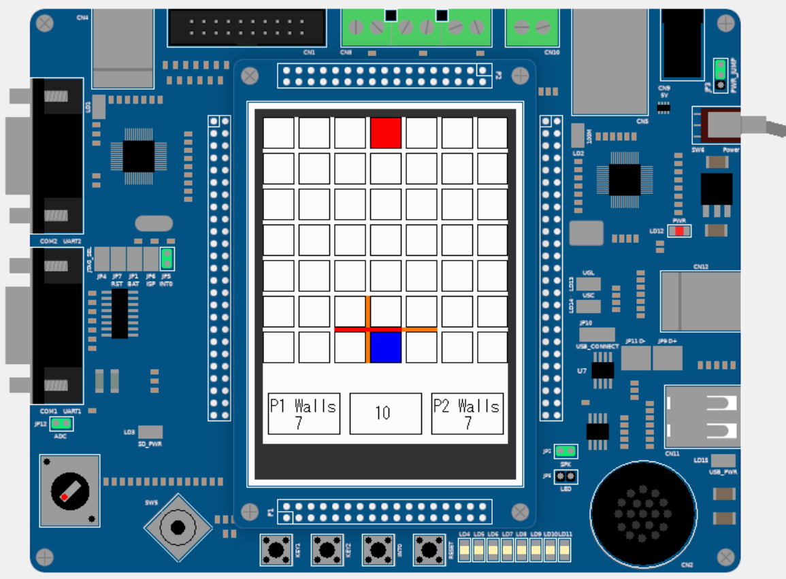
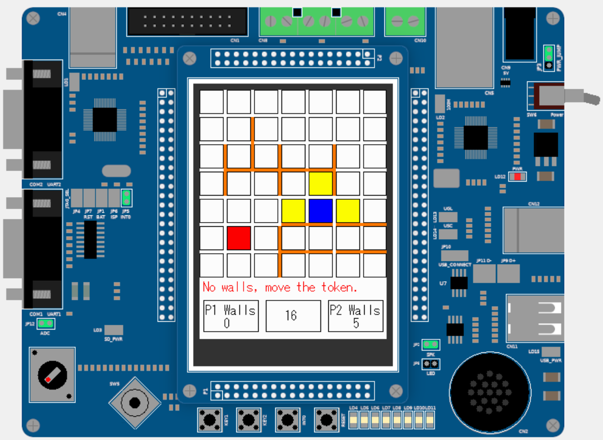
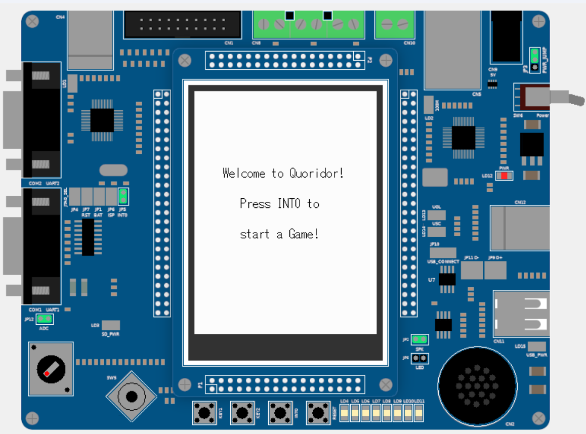
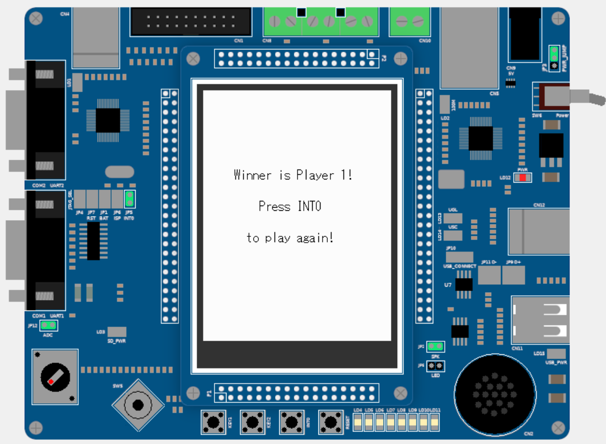

# Quoridor
Part of a project for the Computer Architecture course at the Politecnico di Torino.

Simple implementation of the Quoridor game on LandTiger.

## Rules
Each player is equipped with a token and 8 barriers (walls). The game board is a 7x7 wooden square, with the peculiar feature that the lines dividing and forming the squares are grooved, allowing walls to be inserted.

Each player starts from the centre of their perimeter line (the 4th square), and the goal is to get their token to the opposite perimeter line. The player who achieves this objective first wins.

### Initial Board
The board is composed as shown in the picture with the two tokens (player0 in blue and player1 in red), the number of remaining walls of both players, a countdown of 20 seconds for the turn and the possible moves are highlighted in yellow.

    

### Move
On their turn, a player has two choices:
* He/she can choose to move their token horizontally or vertically; (the chosen move is shown in green).

    

* If two tokens (the moving player and the opponent) are facing each other, the moving player can jump over the opponent and position themselves behind them if there is no barrier behind the opponent.

    

* He/she can choose to place a wall. The wall cannot be jumped over but must be navigated around (the chosen wall is shown in green if it is in a valid position).

    

* It is not allowed to "trap" a player with the help of walls; you must always leave them a way to reach the goal (the wall is shown red and a warning message appear).

      

* Moreover, the walls cannot be overlapped (the wall is showed in red). 

    

* If the walls are ended for a player it's showed a warning message and it is not possible to put others wall. 

    

>Note: A move must be chosen within 20 seconds, or else it loses the turn

### How to play
The game is started by pressing INT0 (initially the software is in waiting mode).

    

Now the game is started, a player has 20 seconds for his turn and with INT1 change the move mode from shift to wall and vice versa.

In shift mode:
* With the joystick (up,down,left and right) a player can choose where to move, and with joystick select can confirm the move.

In wall mode:
* With joystick (up,down,left and right) a player can choose where to put the wall, and with joystick select can confirm the move.
* With INT2 the wall can be rotated by 90°.

When a player reach the other side a new screen will show the winner player and with INT0 a new game can start!

    
